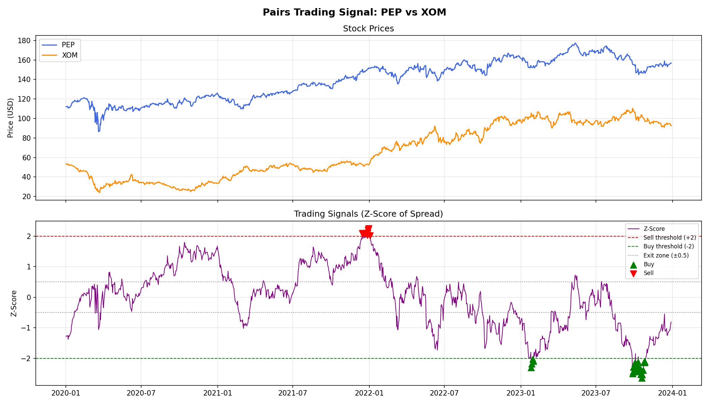
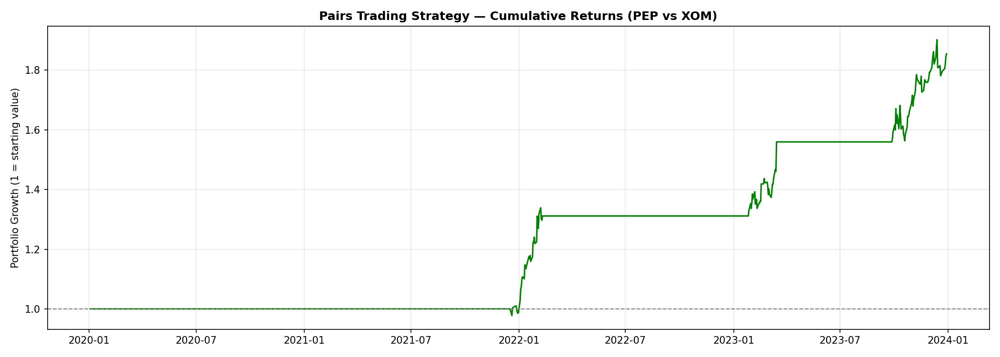

# Pairs Trading Signal Detector

A quantitative trading strategy that identifies statistically cointegrated stock pairs, constructs hedge-ratio-adjusted spreads, and generates mean-reversion signals using rolling z-score analysis with out-of-sample backtesting.

## What it does
- Scans a universe of 16 liquid US stocks across multiple sectors
- Uses the Engle-Granger cointegration test and ADF test to identify statistically valid pairs
- Estimates hedge ratios using Ordinary Least Squares (OLS) regression
- Constructs a market-neutral spread using the hedge ratio
- Generates trading signals using a rolling z-score (60-day window)
- Splits data into formation (60%) and trading (40%) periods to avoid look-ahead bias
- Includes transaction costs and evaluates performance using risk-adjusted metrics

## Results
- Selected pair: MS / YUM
- Cointegration p-value: 0.0004
- ADF p-value: 0.0001
- Hedge ratio (β): 1.2130
- Half-life: 14.57 days
- Total return: 26.23%
- Annualized return: 15.68%
- Sharpe ratio: 0.96
- Max drawdown: -12.82%
- Calmar ratio: 1.22
- Number of trades: 14
- Starting value: $10,000 → Ending value: $12,622.80

## Charts
### Trading Signals


### Cumulative Returns


## Tech Stack
- Python 3
- pandas, numpy
- statsmodels (cointegration, ADF, OLS)
- yfinance (market data)
- matplotlib

## How to run
```bash
pip install yfinance pandas numpy matplotlib statsmodels
python main.py
```

## Key concepts
- **Cointegration:** Identifies pairs of assets whose spread is stationary despite individual price movements
- **ADF Test:** Confirms stationarity of the spread before trading
- **Hedge Ratio (OLS):** Ensures a market-neutral position by adjusting exposure between assets
- **Rolling Z-Score:** Measures deviation from the mean using only past data, avoiding look-ahead bias
- **Half-Life of Mean Reversion:** Estimates how quickly the spread reverts, used to filter tradable pairs
- **Sharpe Ratio:** Measures risk-adjusted return
- **Maximum Drawdown:** Captures the largest peak-to-trough loss
